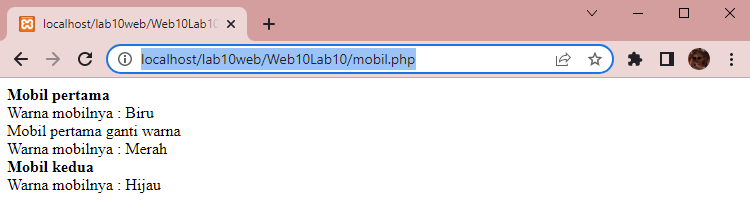
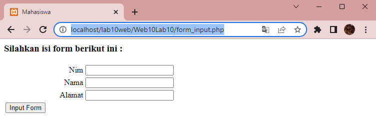

# Web10Lab10

**Nama    : Aning Kinanti** <br>
**NIM     : 312010364** <br>
**Kelas   : TI.20.A2** <br>
**Matkul  : Pemrograman Web** <br>

UNTUK LINK TUGAS LAB 9 DAPAT DIAKSES DI https://github.com/kinantianing/Web9Lab9

# Belajar PHP OOP
1. Pastikan Xampp sudah terinstall dan server dapat berjalan dengan baik http://127.0.0.1 atau http://localhost
2. Tempatkan file website tempatkan di direktori: \xampp\htdocs\

## A. Prgram OOP Sederhana Dengan PHP
### 1. Membuat File Mobil Php
Buatlah dokumen PHP dengan nama `mobil.php` seperti contoh dibawah ini : <br>
```
<?php
//Program sederhana pendefinisian class dan pemanggilan class.

class Mobil {
    private $warna;
    private $merk;
    private $harga;

    public function __construct() {
        $this->warna = "Biru";
        $this->merk = "BMW";
        $this->harga = "10000000";
    }

    public function gantiWarna ($warnaBaru) {
        $this->warna = $warnaBaru;
    }

    public function tampilWarna () {
        echo "Warna mobilnya : " . $this->warna;
    }
}

// membuat objek mobil
$a = new Mobil();
$b = new Mobil();

// memanggil objek
echo "<b>Mobil pertama</b><br>";
$a->tampilWarna();

echo "<br>Mobil pertama ganti warna<br>";
$a->gantiWarna("Merah");
$a->tampilWarna();

// memanggil objek
echo "<br><b>Mobil kedua</b><br>";
$b->gantiWarna("Hijau");
$b->tampilWarna();

?>
```
<br>

### 2. Membuat File Form Php
Buatlah dokumen PHP dengan nama `form.php` seperti contoh dibawah ini : <br>
```
<?php
// Nama Class: Form
// Des: CLass untuk membuat form inputan text sederhan

class Form {
    private $fields = array();
    private $action;
    private $submit = "Submit Form";
    private $jumField = 0;

    public function __construct($action, $submit) {
        $this->action = $action;
        $this->submit = $submit;
    }

    public function displayForm()
    {
        echo "<form action='".$this->action."' method='POST'>";
        echo '<table width="100%" border="0">';
        for ($j=0; $j<count($this->fields); $j++) {
            echo "<tr><td align='right'>".$this->fields[$j]['label']."</td>";
            echo "<td><input type='text' name='".$this->fields[$j]['name']."'></td></tr>";
        }
        echo "<tr><td colspan='2'>";
        echo "<input type='submit' value='".$this->submit."'></td></tr>";
        echo "</table>";
    }

    public function addField($name, $label) {
        $this->fields [$this->jumField]['name'] = $name;
        $this->fields [$this->jumField]['label'] = $label;
        $this->jumField ++;
    }
}
?>
```
<br>

### 3. Membuat File Form Input Php
Buatlah dokumen PHP dengan nama `form_input.php` seperti contoh dibawah ini : <br>
```
<?php
// Program memanfaatkan Program 10.2 untuk membuat form inputan sederhana.

include "form.php";

echo "<html><head><title>Mahasiswa</title></head><body>";
$form = new Form("","Input Form");
$form->addField("txtnim", "Nim");
$form->addField("txtnama", "Nama");
$form->addField("txtalamat", "Alamat");
echo "<h3>Silahkan isi form berikut ini :</h3>";
$form->displayForm();
echo "</body></html>";
?>
```
<br>

Kemudian untuk mengakses hasilnya melalui URL: http://localhost/lab10web/ <br>

Kemudian run file `mobil.php` dengan url : http://localhost/lab10web/Web10Lab10/mobil.php <br>
Maka hasilnya akan menjadi seperti dibawah ini : <br>
 <br>

Lalu run file `form_input.php` dengan url : http://localhost/lab10web/Web10Lab10/form_input.php <br>
Maka hasilnya akan menjadi seperti dibawah ini : <br>
 <br>
